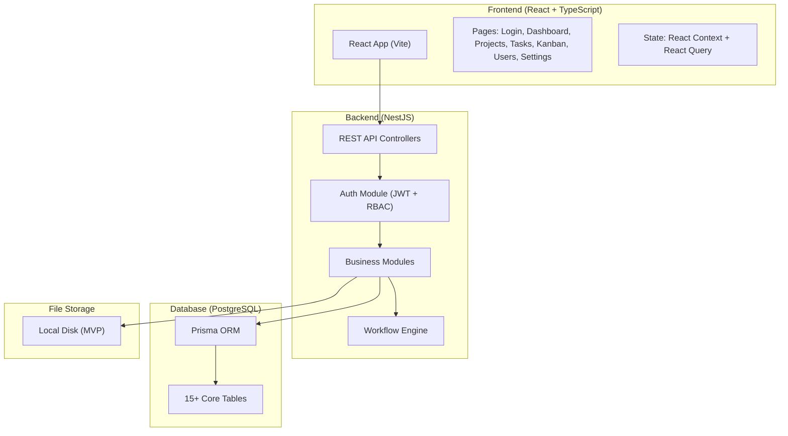

# SPMS — Smart Project Management System: MVP Implementation Plan

## Overview

Build the **MVP foundation** of a modular business operating platform. The MVP focuses on **User Management + Project/Task Management + Basic Workflow Engine + Dashboard**. CRM, HRMS, Automation, and AI are deferred to later phases.

**Workspace:** `c:/Users/vrnre/OneDrive/SPMS Project`  
**Tech Stack:** React + TypeScript | NestJS + Node.js | PostgreSQL + Prisma | JWT + RBAC

---

## Architecture



---

## User Review Required

> [!IMPORTANT]
> **Project Location**: The code will be scaffolded inside `c:/Users/vrnre/OneDrive/SPMS Project` with two sub-directories:
> - `spms-backend/` — NestJS API server
> - `spms-frontend/` — React (Vite) client app
> 
> Please confirm this structure is acceptable.

> [!IMPORTANT]
> **Database Setup**: You will need PostgreSQL installed locally (or via Docker). The plan assumes a local PostgreSQL instance at `localhost:5432`. Please confirm you have PostgreSQL available, or if you'd prefer Docker.

> [!WARNING]
> **MVP Scope Boundary**: The following are explicitly **excluded** from this MVP build:
> - CRM module (leads, clients, pipeline)
> - HRMS module (attendance, leave, payroll)
> - Automation rules engine
> - AI features
> - Mobile app
> - Real-time WebSocket updates (basic polling first)
> 
> These will be added in subsequent phases after the core is stable.

---

## Open Questions

> [!IMPORTANT]
> 1. **Company Name / Branding**: What should the app title be? "SPMS", "Technoedge Platform", or something else?
> 2. **Department List**: Should we seed the database with your actual departments (Content, ID, QC, Sales, Accounts, AI, Editor, HR) or start with empty?
> 3. **PostgreSQL**: Do you have PostgreSQL installed, or should we set up Docker Compose for the database?
> 4. **UI Library Preference**: The ChatGPT conversation mentioned Tailwind CSS or Ant Design. Which do you prefer? I recommend **Ant Design** for faster enterprise UI development (tables, forms, modals are built-in).

---

## Proposed Changes

### Sprint 1: Project Scaffolding + Database + Authentication

#### [NEW] `spms-backend/` — NestJS Backend Application

Initialize NestJS project with:
- TypeScript strict mode
- Prisma ORM integration
- JWT authentication module
- RBAC guard system
- Environment configuration (.env)
- CORS configuration for frontend

**Database Schema (Prisma):**

```prisma
// === IDENTITY ===
model User {
  id            String   @id @default(uuid())
  email         String   @unique
  password      String   // bcrypt hashed
  firstName     String
  lastName      String
  avatar        String?
  isActive      Boolean  @default(true)
  createdAt     DateTime @default(now())
  updatedAt     DateTime @updatedAt

  userRoles     UserRole[]
  department    Department? @relation(fields: [departmentId], references: [id])
  departmentId  String?
  assignedTasks TaskAssignee[]
  comments      TaskComment[]
  notifications Notification[]
  auditLogs     AuditLog[]
  projectMembers ProjectMember[]
}

model Role {
  id          String   @id @default(uuid())
  name        String   @unique  // Admin, Manager, TeamLead, Employee
  description String?
  userRoles   UserRole[]
  permissions RolePermission[]
}

model Permission {
  id          String   @id @default(uuid())
  module      String   // project, task, user, workflow
  action      String   // create, read, update, delete, assign, approve
  rolePerms   RolePermission[]
}

model UserRole {
  id     String @id @default(uuid())
  user   User   @relation(fields: [userId], references: [id])
  userId String
  role   Role   @relation(fields: [roleId], references: [id])
  roleId String
  @@unique([userId, roleId])
}

model RolePermission {
  id           String     @id @default(uuid())
  role         Role       @relation(fields: [roleId], references: [id])
  roleId       String
  permission   Permission @relation(fields: [permissionId], references: [id])
  permissionId String
  @@unique([roleId, permissionId])
}

model Department {
  id        String   @id @default(uuid())
  name      String   @unique
  code      String   @unique
  managerId String?
  users     User[]
  createdAt DateTime @default(now())
}

// === PROJECT & TASK ===
model Project {
  id          String   @id @default(uuid())
  name        String
  description String?
  status      String   @default("active") // active, archived, completed
  startDate   DateTime?
  endDate     DateTime?
  createdBy   String
  createdAt   DateTime @default(now())
  updatedAt   DateTime @updatedAt

  tasks       Task[]
  members     ProjectMember[]
}

model ProjectMember {
  id        String  @id @default(uuid())
  project   Project @relation(fields: [projectId], references: [id])
  projectId String
  user      User    @relation(fields: [userId], references: [id])
  userId    String
  role      String  @default("member") // owner, manager, member
  @@unique([projectId, userId])
}

model Task {
  id          String   @id @default(uuid())
  title       String
  description String?
  priority    String   @default("medium") // low, medium, high, urgent
  status      String   @default("open")   // open, assigned, in_progress, review, done
  dueDate     DateTime?
  position    Int      @default(0)  // for Kanban ordering

  project     Project  @relation(fields: [projectId], references: [id])
  projectId   String
  createdBy   String
  createdAt   DateTime @default(now())
  updatedAt   DateTime @updatedAt

  assignees      TaskAssignee[]
  comments       TaskComment[]
  attachments    TaskAttachment[]
  statusHistory  TaskStatusHistory[]
  parentTask     Task?   @relation("Subtasks", fields: [parentTaskId], references: [id])
  parentTaskId   String?
  subtasks       Task[]  @relation("Subtasks")
}

model TaskAssignee {
  id     String @id @default(uuid())
  task   Task   @relation(fields: [taskId], references: [id])
  taskId String
  user   User   @relation(fields: [userId], references: [id])
  userId String
  @@unique([taskId, userId])
}

// === WORKFLOW ===
model WorkflowDefinition {
  id          String   @id @default(uuid())
  name        String   @unique  // "Task Workflow", "Leave Workflow"
  module      String   // task, leave, lead
  isActive    Boolean  @default(true)
  states      WorkflowState[]
  transitions WorkflowTransition[]
}

model WorkflowState {
  id           String   @id @default(uuid())
  workflow     WorkflowDefinition @relation(fields: [workflowId], references: [id])
  workflowId   String
  name         String   // open, assigned, in_progress, review, done
  label        String   // "Open", "Assigned", "In Progress", "Review", "Done"
  color        String   @default("#6B7280")
  position     Int      @default(0)
  isFinal      Boolean  @default(false)
  fromTransitions WorkflowTransition[] @relation("FromState")
  toTransitions   WorkflowTransition[] @relation("ToState")
}

model WorkflowTransition {
  id            String   @id @default(uuid())
  workflow      WorkflowDefinition @relation(fields: [workflowId], references: [id])
  workflowId    String
  fromState     WorkflowState @relation("FromState", fields: [fromStateId], references: [id])
  fromStateId   String
  toState       WorkflowState @relation("ToState", fields: [toStateId], references: [id])
  toStateId     String
  actionLabel   String   // "Start Work", "Submit for Review", "Approve", "Reject"
  allowedRoles  String[] // ["Admin", "Manager", "TeamLead"]
}

model TaskStatusHistory {
  id         String   @id @default(uuid())
  task       Task     @relation(fields: [taskId], references: [id])
  taskId     String
  fromStatus String
  toStatus   String
  changedBy  String
  changedAt  DateTime @default(now())
  comment    String?
}

// === COLLABORATION ===
model TaskComment {
  id        String   @id @default(uuid())
  task      Task     @relation(fields: [taskId], references: [id])
  taskId    String
  user      User     @relation(fields: [userId], references: [id])
  userId    String
  content   String
  createdAt DateTime @default(now())
  updatedAt DateTime @updatedAt
}

model TaskAttachment {
  id         String   @id @default(uuid())
  task       Task     @relation(fields: [taskId], references: [id])
  taskId     String
  fileName   String
  filePath   String
  fileSize   Int
  mimeType   String
  uploadedBy String
  uploadedAt DateTime @default(now())
}

// === SYSTEM ===
model Notification {
  id        String   @id @default(uuid())
  user      User     @relation(fields: [userId], references: [id])
  userId    String
  title     String
  message   String
  type      String   // task_assigned, status_changed, comment_added, deadline
  isRead    Boolean  @default(false)
  link      String?
  createdAt DateTime @default(now())
}

model AuditLog {
  id        String   @id @default(uuid())
  user      User     @relation(fields: [userId], references: [id])
  userId    String
  action    String   // create, update, delete, login, status_change
  entity    String   // user, project, task, workflow
  entityId  String
  details   Json?
  createdAt DateTime @default(now())
}
```

**Auth API Endpoints:**

| Method | Endpoint | Purpose |
|--------|----------|---------|
| POST | `/api/auth/login` | Email/password login → JWT |
| POST | `/api/auth/refresh` | Refresh access token |
| POST | `/api/auth/logout` | Invalidate refresh token |
| GET | `/api/auth/me` | Get current user profile |
| POST | `/api/auth/forgot-password` | Send reset email |
| POST | `/api/auth/reset-password` | Reset password with token |

---

#### [NEW] `spms-frontend/` — React Frontend Application

Initialize Vite + React + TypeScript project with:
- React Router v6 for navigation
- React Query for API state management
- Ant Design (or Tailwind — pending your choice) for UI
- Axios for HTTP client
- React Context for auth state
- Protected route wrapper

**Initial Pages:**
- Login page (premium design with gradient background)
- App layout with sidebar navigation
- 404 page

---

### Sprint 2: User, Role & Department Management

#### [MODIFY] Backend — User Management Module

**API Endpoints:**

| Method | Endpoint | Purpose |
|--------|----------|---------|
| GET | `/api/users` | List all users (paginated) |
| GET | `/api/users/:id` | Get user details |
| POST | `/api/users` | Create user (Admin only) |
| PATCH | `/api/users/:id` | Update user |
| DELETE | `/api/users/:id` | Deactivate user |
| POST | `/api/users/:id/roles` | Assign roles |
| GET | `/api/roles` | List all roles |
| GET | `/api/departments` | List departments |
| POST | `/api/departments` | Create department |
| PATCH | `/api/departments/:id` | Update department |

#### [MODIFY] Frontend — Admin Screens

- **User Management Page**: Table with search, filter by role/department, add/edit user modal
- **Role Management Page**: View roles, assign permissions
- **Department Management Page**: CRUD departments, assign department manager

---

### Sprint 3: Project & Task Management

#### [MODIFY] Backend — Project & Task Modules

**Project API:**

| Method | Endpoint | Purpose |
|--------|----------|---------|
| GET | `/api/projects` | List projects (filtered by role) |
| GET | `/api/projects/:id` | Project details + members |
| POST | `/api/projects` | Create project |
| PATCH | `/api/projects/:id` | Update project |
| DELETE | `/api/projects/:id` | Archive project |
| POST | `/api/projects/:id/members` | Add member |
| DELETE | `/api/projects/:id/members/:userId` | Remove member |

**Task API:**

| Method | Endpoint | Purpose |
|--------|----------|---------|
| GET | `/api/projects/:id/tasks` | List tasks in project |
| GET | `/api/tasks/:id` | Task details |
| POST | `/api/projects/:id/tasks` | Create task |
| PATCH | `/api/tasks/:id` | Update task |
| DELETE | `/api/tasks/:id` | Delete task |
| POST | `/api/tasks/:id/assign` | Assign user(s) |
| PATCH | `/api/tasks/:id/status` | Change status (via workflow) |
| GET | `/api/tasks/my-tasks` | Get current user's tasks |

#### [MODIFY] Frontend — Project & Task Screens

- **Project List Page**: Card/table view with status filters
- **Project Detail Page**: Overview + task list + members
- **Task Creation Modal**: Title, description, priority, assignee, due date
- **Task Detail Page**: Full task view with status, history, comments

---

### Sprint 4: Workflow Engine

#### [MODIFY] Backend — Workflow Module

**Workflow API:**

| Method | Endpoint | Purpose |
|--------|----------|---------|
| GET | `/api/workflows` | List workflow definitions |
| GET | `/api/workflows/:id` | Workflow details with states/transitions |
| POST | `/api/workflows` | Create workflow (Admin) |
| GET | `/api/workflows/:id/transitions` | Get allowed transitions for current state |
| POST | `/api/tasks/:id/transition` | Execute transition (status change) |
| GET | `/api/tasks/:id/history` | Get status change history |

**Seed Data — Default Task Workflow:**

```
States:  Open → Assigned → In Progress → Review → Done
Transitions:
  Open → Assigned        (Admin, Manager, TeamLead)
  Assigned → In Progress (Assigned Employee)
  In Progress → Review   (Assigned Employee)
  Review → Done          (Manager, TeamLead)
  Review → In Progress   (Manager, TeamLead)  // Reject back
```

---

### Sprint 5: Kanban Board

#### [MODIFY] Frontend — Kanban Board

- **Kanban Board Page**: Drag-and-drop columns for each workflow state
- Columns: Open | Assigned | In Progress | Review | Done
- Task cards showing: title, priority badge, assignee avatar, due date
- Drag a card to change status (calls workflow transition API)
- Filter by: assignee, priority, due date
- Library: `@dnd-kit/core` for drag-and-drop

---

### Sprint 6: Comments, Attachments & Notifications

#### [MODIFY] Backend — Collaboration Module

**Comment API:**

| Method | Endpoint | Purpose |
|--------|----------|---------|
| GET | `/api/tasks/:id/comments` | List comments |
| POST | `/api/tasks/:id/comments` | Add comment |
| PATCH | `/api/comments/:id` | Edit comment |
| DELETE | `/api/comments/:id` | Delete comment |

**Attachment API:**

| Method | Endpoint | Purpose |
|--------|----------|---------|
| GET | `/api/tasks/:id/attachments` | List attachments |
| POST | `/api/tasks/:id/attachments` | Upload file |
| DELETE | `/api/attachments/:id` | Delete file |

**Notification API:**

| Method | Endpoint | Purpose |
|--------|----------|---------|
| GET | `/api/notifications` | Get user's notifications |
| PATCH | `/api/notifications/:id/read` | Mark as read |
| PATCH | `/api/notifications/read-all` | Mark all as read |

#### [MODIFY] Frontend

- Comment thread in task detail page
- File upload UI in task detail page
- Notification bell in header with dropdown
- Notification list page

---

### Sprint 7: Dashboard & Basic Reports

#### [MODIFY] Backend — Dashboard Module

**Dashboard API:**

| Method | Endpoint | Purpose |
|--------|----------|---------|
| GET | `/api/dashboard/summary` | Counts: total tasks, projects, pending, overdue |
| GET | `/api/dashboard/task-stats` | Tasks by status, priority |
| GET | `/api/dashboard/my-workload` | Current user's task distribution |
| GET | `/api/dashboard/recent-activity` | Latest actions across system |
| GET | `/api/dashboard/overdue-tasks` | Tasks past due date |

#### [MODIFY] Frontend — Dashboard

- **Main Dashboard**: Stat cards (total projects, tasks, pending, overdue)
- **Charts**: Task distribution by status (donut), tasks by priority (bar), weekly completion trend (line)
- **Recent Activity Feed**: Timeline of latest actions
- **My Tasks Widget**: Quick view of assigned tasks
- **Overdue Alert Widget**: Highlighted overdue tasks
- Chart library: **Recharts**

---

### Sprint 8: Testing, Polish & Deployment

- End-to-end testing of all flows
- UI polish and responsive design
- Error handling and validation
- Docker Compose for backend + database
- README documentation
- Seed script for demo data

---

## Verification Plan

### Automated Tests
- Backend: Unit tests for auth, workflow transitions, RBAC guards using Jest
- Database: Prisma migration validation
- API: Integration tests for critical endpoints (login, create task, status transition)

### Manual Verification
- **Auth Flow**: Login → JWT stored → protected routes work → logout clears token
- **RBAC**: Admin sees all, Employee sees only assigned tasks
- **Workflow**: Task moves Open → Assigned → In Progress → Review → Done (and reject flow)
- **Kanban**: Drag-and-drop updates status correctly
- **Dashboard**: Numbers match actual data
- Browser testing via the browser tool to verify UI rendering and interactions

### Browser-Based Verification
- Navigate to login page, verify premium UI rendering
- Complete login flow, verify redirect to dashboard
- Create project → create task → assign → move through workflow
- Verify Kanban board drag-and-drop
- Verify dashboard stats update after task operations
